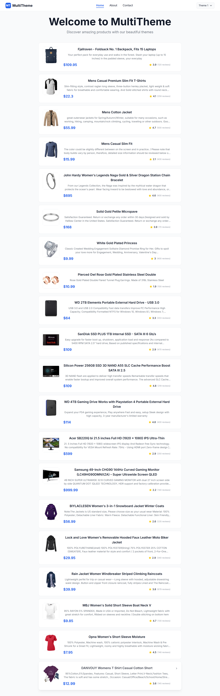
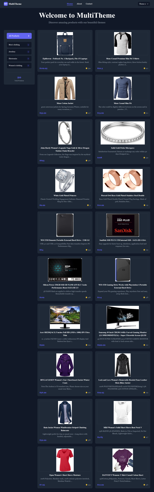
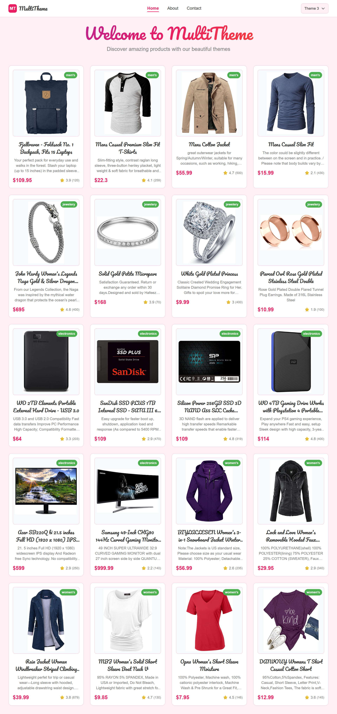

# Multi-Theme Switcher App

A beautiful React + TypeScript web application that demonstrates dynamic theming with three distinct themes, each with unique layouts, colors, and typography.

## 🎨 Features

### Theme System
- **Theme 1 (Minimal)**: Light background, minimalist layout, simple sans-serif font
- **Theme 2 (Dark)**: Dark mode with sidebar layout and bold serif font  
- **Theme 3 (Colorful)**: Vibrant colors with card-based grid layout and playful Google Font (Pacifico)

### Core Features
- ✅ React Router navigation with Home, About, and Contact pages
- ✅ Fixed header with theme switcher dropdown
- ✅ Theme persistence using localStorage
- ✅ Context API for state management
- ✅ Product data fetching from FakeStore API
- ✅ Responsive design with Tailwind CSS
- ✅ Smooth theme transition animations
- ✅ Contact form with validation
- ✅ Google Fonts integration
- ✅ TypeScript for type safety

## 🚀 Getting Started

### Prerequisites
- Node.js (version 18 or higher)
- npm or yarn

### Installation

1. Clone the repository:
```bash
git clone <repository-url>
cd multi-theme
```

2. Install dependencies:
```bash
npm install
```

3. Start the development server:
```bash
npm run dev
```

4. Open your browser and navigate to `http://localhost:5173`

## 📁 Project Structure

```
src/
├── components/
│   └── Header.tsx          # Navigation header with theme switcher
├── contexts/
│   └── ThemeContext.tsx    # Theme state management
├── pages/
│   ├── Home.tsx           # Product listing page
│   ├── About.tsx          # About page
│   └── Contact.tsx        # Contact form page
├── themes/
│   └── themes.ts          # Theme configurations
├── types/
│   └── theme.ts           # TypeScript type definitions
├── App.tsx                # Main application component
├── main.tsx              # Application entry point
└── index.css             # Global styles and fonts
```

## 🎯 Theme Details

### Theme 1 - Minimal

- **Colors**: Light background with blue accents
- **Layout**: Clean, minimal design with horizontal product cards
- **Typography**: Inter font family
- **Spacing**: Compact 1rem spacing

### Theme 2 - Dark

- **Colors**: Dark background with purple accents
- **Layout**: Sidebar layout with category navigation
- **Typography**: Georgia serif font
- **Spacing**: Comfortable 1.5rem spacing

### Theme 3 - Colorful

- **Colors**: Vibrant yellow background with pink accents
- **Layout**: Card-based grid layout with hover effects
- **Typography**: Pacifico cursive font
- **Spacing**: Generous 2rem spacing

## 🔧 Technical Implementation

### Theme Context
The application uses React Context API for theme state management:

```typescript
interface ThemeContextType {
  currentTheme: ThemeType;
  theme: Theme;
  setTheme: (theme: ThemeType) => void;
}
```

### Theme Persistence
Themes are automatically saved to localStorage and restored on page reload:

```typescript
useEffect(() => {
  const savedTheme = localStorage.getItem('selectedTheme') as ThemeType;
  if (savedTheme && themes[savedTheme]) {
    setCurrentTheme(savedTheme);
  }
}, []);
```

### Product Data
Products are fetched from the FakeStore API and displayed according to the current theme's layout:

```typescript
const response = await fetch('https://fakestoreapi.com/products');
const data = await response.json();
setProducts(data);
```

## 🎨 Styling

The application uses Tailwind CSS for styling with custom theme configurations. Each theme defines:

- Color palette (primary, secondary, background, surface, text, etc.)
- Font families (heading and body fonts)
- Layout type (minimal, sidebar, card-grid)
- Spacing preferences

## 📱 Responsive Design

The application is fully responsive and works on:
- Desktop computers
- Tablets
- Mobile phones

Key responsive features:
- Mobile-friendly navigation
- Responsive grid layouts
- Touch-friendly buttons and forms
- Optimized typography scaling

## 🔒 Security & Best Practices

- Input validation on contact form
- XSS protection through React's built-in escaping
- Secure API calls with error handling
- Accessibility features (focus indicators, semantic HTML)
- Cross-browser compatibility

## 🚀 Available Scripts

- `npm run dev` - Start development server
- `npm run build` - Build for production
- `npm run preview` - Preview production build
- `npm run lint` - Run ESLint

## 🛠️ Technologies Used

- **React 19** - UI framework
- **TypeScript** - Type safety
- **React Router** - Navigation
- **Tailwind CSS** - Styling
- **Context API** - State management
- **FakeStore API** - Product data
- **Google Fonts** - Typography
- **Vite** - Build tool

## 📄 License

This project is open source and available under the [MIT License](LICENSE).

## 🤝 Contributing

Contributions are welcome! Please feel free to submit a Pull Request.

## 📞 Support

If you have any questions or need help, please open an issue on GitHub.
